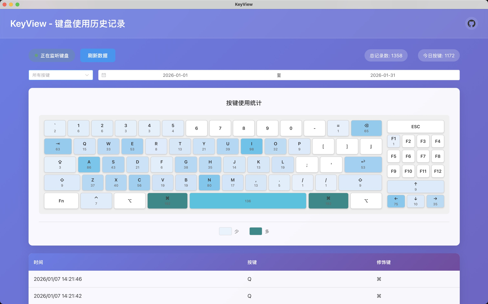

# KeyView

<div align="center">

**键盘使用历史记录查看工具**

基于 Wails v3 + Vue3 + SQLite3 构建的现代化键盘按键记录与分析工具

[](https://golang.org/)
[](https://vuejs.org/)
[](LICENSE)

</div>

## ✨ 功能特性

- **🔤 实时键盘监听** - 自动记录所有键盘按键事件
- **💾 SQLite 数据存储** - 持久化存储，轻量高效
- **🔍 强大筛选功能** - 按按键名称、日期、动作类型灵活筛选
- **📊 数据统计分析** - 实时显示总记录数、今日按键次数
- **🎨 现代化 UI** - 基于 Vue3 + Element Plus 的美观界面
- **⚡ 高性能** - 分页显示，流畅处理大量数据

## 📸 应用截图



## 🛠️ 技术栈

### 后端
- **Go 1.24+** - 核心编程语言
- **Wails v3.0.0-alpha.51** - 桌面应用框架
- **github.com/wangle201210/keylogger** - 键盘事件监听
- **GORM + SQLite3** - 数据库 ORM

### 前端
- **Vue 3** - 渐进式 JavaScript 框架
- **Element Plus** - Vue 3 UI 组件库
- **Vite** - 快速构建工具

## 📦 安装与运行

### 前置要求

- Go 1.24 或更高版本
- Node.js 18+ 和 npm
- macOS 系统
- Xcode 命令行工具

### 快速开始

1. **克隆项目**
```bash
git clone --recurse-submodules <repository-url>
cd keyview
```

2. **安装依赖**
```bash
# 安装前端依赖
make frontend-install

# 安装 Go 依赖
go mod tidy
```

3. **运行应用**
```bash
make run
```

### 开发模式

```bash
# 开发前端（支持热重载）
cd frontend && npm run dev

# 完整开发模式
make dev
```

## 📖 使用说明

### 基本操作

1. **启动应用** - 运行后自动打开主窗口
2. **开始记录** - 点击"开始记录"按钮监听键盘事件
3. **查看数据** - 实时查看按键历史记录
4. **筛选记录** - 使用筛选器查找特定记录
5. **停止记录** - 点击"停止记录"暂停监听

### 筛选功能

- **按键筛选** - 选择特定按键查看其历史
- **日期筛选** - 按日期查看记录
- **动作筛选** - 筛选"按下"或"释放"事件

### 统计信息

- **总记录数** - 数据库中的总记录数量
- **今日按键** - 今日按键次数（仅统计按下事件）

## 📂 项目结构

```
keyview/
├── main.go              # 应用入口
├── internal/
│   └── app/
│       └── service.go   # 后端服务
├── frontend/            # Vue3 前端
│   ├── src/
│   │   ├── App.vue     # 主组件
│   │   ├── main.js     # 前端入口
│   │   └── services/   # API 服务
│   └── package.json
├── image/              # 截图和资源
├── go.mod
├── Makefile
└── README.md
```

## 🔒 隐私与安全

⚠️ **重要提示**

- 本工具仅供个人使用统计和分析
- 所有数据存储在本地 SQLite 数据库
- 请勿用于未经授权的监控
- 建议定期清理历史数据

### 数据存储位置

数据库文件：`keyview.db`（应用运行目录）

### macOS 权限设置

键盘监听需要辅助功能权限：

1. 打开"系统设置" > "隐私与安全性" > "辅助功能"
2. 添加 KeyView 到允许列表
3. 重启应用

## 🔧 常见问题

### 构建失败

安装 Xcode 命令行工具：
```bash
xcode-select --install
```

### 权限问题

按上述步骤授予辅助功能权限

### 前端未构建

```bash
cd frontend && npm run build
```

## 📝 Make 命令

```bash
make run           # 运行应用
make build         # 构建应用
make clean         # 清理构建文件
make fmt           # 格式化代码
make frontend-build   # 构建前端
make frontend-install # 安装前端依赖
```

## 🤝 贡献

欢迎提交 Issue 和 Pull Request！

## 📄 许可证

本项目采用 MIT 许可证 - 详见 [LICENSE](LICENSE) 文件

## 🙏 致谢

- [Wails](https://wails.io/) - 优秀的 Go 桌面应用框架
- [Vue.js](https://vuejs.org/) - 渐进式 JavaScript 框架
- [Element Plus](https://element-plus.org/) - 优秀的 Vue 3 组件库
- [GORM](https://gorm.io/) - Go 的 ORM 库

---

<div align="center">
Made with ❤️ by KeyView Team
</div>
